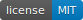
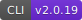
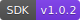

<p align="center">
  <a href="https://postqueen.ai">
    
  </a>
</p>

<h3 align="center">
  <a href="https://postqueen.ai/agent">🆕 NEW: meet the PostQueen Agent, run your social media from Claude Code, ChatGPT, OpenClaw or Hermes »</a>
</h3>

<br/>

<p align="center">
  <strong>Stop doing social media yourself.</strong>
</p>

<p align="center">
  PostQueen is an AI employee for your social media. Tell her what to share, in one sentence. She writes the copy, designs the visual and schedules it on every channel you have. You just review the calendar.
</p>

<p align="center">
  <strong><a href="https://postqueen.ai">PostQueen</a></strong> is the open-source alternative to <strong>Buffer, Hootsuite, Sprout Social</strong> and <strong>Later</strong>.
</p>

<br/>

<p align="center"></p>

<br/>

<p align="center">
  <a href="https://postqueen.ai">Website</a> &nbsp;·&nbsp;
  <a href="https://postqueen.ai/pricing">Pricing</a> &nbsp;·&nbsp;
  <a href="https://docs.postqueen.ai">Docs</a> &nbsp;·&nbsp;
  <a href="https://api.postqueen.ai/docs">API Reference</a> &nbsp;·&nbsp;
  <a href="https://postqueen.ai/agent">Agents</a> &nbsp;·&nbsp;
  <a href="https://postqueen.ai/mcp">MCP</a> &nbsp;·&nbsp;
  <a href="https://www.npmjs.com/package/postqueen">CLI</a>
</p>

<p align="center">
  <a href="https://github.com/GkhanKINAY/postqueen-docs/blob/main/LICENSE"></a>
  <a href="https://www.npmjs.com/package/postqueen"></a>
  <a href="https://www.npmjs.com/package/@postqueen/node"></a>
  <a href="https://www.npmjs.com/package/n8n-nodes-postqueen"></a>
</p>

<br/>

<p align="center">
  <!-- CHANNEL ICONS: 30 individual imgs, natural flow, mobile-wrap -->
                               
</p>


<br/>

<p align="center"></p>

<br/>

<h3 align="center">Schedule and generate posts with AI</h3>

<p align="center">
  
</p>

<br/>

<p align="center">
  <strong>Free for 7 days in the cloud. Forever free on your own server.</strong>
</p>

<p align="center">
  <a href="https://postqueen.ai"></a>
  &nbsp;&nbsp;
  <a href="https://github.com/GkhanKINAY/postqueen-docker-compose"></a>
</p>

<br/>

---

## 📚 Read the docs

**The docs live at [docs.postqueen.ai](https://docs.postqueen.ai)**, the rendered, searchable version of everything in this repo. Whatever you came to do, this map takes you straight there:

| Section | What you will find | Start at |
| --- | --- | --- |
| Getting started | Meet her and publish your first post | [/introduction](https://docs.postqueen.ai/introduction) · [/quickstart](https://docs.postqueen.ai/quickstart) · [/howitworks](https://docs.postqueen.ai/howitworks) |
| Self-hosting | Docker Compose, plain Docker, Kubernetes, system requirements | [/installation/docker-compose](https://docs.postqueen.ai/installation/docker-compose) · [/installation/kubernetes-helm](https://docs.postqueen.ai/installation/kubernetes-helm) |
| Configuration | Every environment variable and integration setting | [/configuration/reference](https://docs.postqueen.ai/configuration/reference) |
| Providers | Per-network OAuth app setup guides (X, LinkedIn, Instagram, TikTok and more) | [/providers/overview](https://docs.postqueen.ai/providers/overview) |
| CLI | The `postqueen` command line for scripts and AI agents | [/cli/introduction](https://docs.postqueen.ai/cli/introduction) |
| MCP | Connect AI assistants over the Model Context Protocol | [/mcp/introduction](https://docs.postqueen.ai/mcp/introduction) |
| Public API | All 22 REST endpoints, with working examples | [/public-api/introduction](https://docs.postqueen.ai/public-api/introduction) |
| Reverse proxies | Caddy, nginx, Traefik recipes for HTTPS | [/reverse-proxies/caddy](https://docs.postqueen.ai/reverse-proxies/caddy) |
| Troubleshooting | The common failures and how to fix them | [/troubleshooting/overview](https://docs.postqueen.ai/troubleshooting/overview) |

The docs also ship `llms.txt` and `llms-full.txt`, so AI assistants can pull the whole site in one request. Mintlify serves both automatically.

---

## 🚀 API quick taste

The public API lives at `https://api.postqueen.ai/public/v1`. Authentication is a single `Authorization` header carrying your raw API key, no `Bearer` prefix needed.

<p align="center">
  
</p>

```bash
curl https://api.postqueen.ai/public/v1/integrations \
  -H "Authorization: $POSTQUEEN_API_KEY"
```

And that is all it takes. The full reference, every endpoint and every per-network settings schema, is at [docs.postqueen.ai/public-api/introduction](https://docs.postqueen.ai/public-api/introduction), and you can try calls live in the Swagger playground at [api.postqueen.ai/docs](https://api.postqueen.ai/docs).

---

## 🖥️ Run these docs locally

This site is built with [Mintlify](https://mintlify.com):

```bash
npm i -g mint     # install the Mintlify CLI
mint dev          # serve the docs at http://localhost:3000
```

`docs.json` defines the navigation; every page is an `.mdx` file in this repo.

---

## ✍️ Contributing

Fixes and clarifications are welcome. If you spot a typo, a stale flag or a missing step, open a PR: the site deploys from this repo, so merged changes go straight to [docs.postqueen.ai](https://docs.postqueen.ai).

Want to contribute to the app itself? Start with the [developer guide](https://docs.postqueen.ai/developer-guide).

---

## 🦞 Meet her open agents: OpenClaw &amp; Hermes

Two open-source agents already speak PostQueen natively. **OpenClaw** lives on your machine and turns any chat app into her front door. **Hermes** does the same, then goes further: hand it a single brief and it plans, writes and schedules your entire week on its own. Both drive the same `postqueen` CLI, so everything they do shows up on your calendar.

<p align="center">
  
</p>

<a href="https://postqueen.ai/openclaw"></a> <a href="https://postqueen.ai/hermes-agent"></a>

**Any other agent works too.** If it can run a CLI command or call MCP, it can run your socials. [Agent guide »](https://postqueen.ai/agent)

<br/>

---

## 🌐 Publish everywhere

One post from you, and she is everywhere at once. PostQueen publishes to **30+ networks** out of the box:

<p align="center">
                               
</p>

| Category | Networks |
| --- | --- |
| **Major social** | X, LinkedIn, Instagram, Facebook, TikTok, YouTube, Threads, Pinterest, Reddit, Bluesky |
| **Community and chat** | Discord, Slack, Telegram, Mastodon, Twitch, Kick, MeWe, VK |
| **Publishing and blogs** | WordPress, Medium, Dev.to, Hashnode, Tumblr, Listmonk, Moltbook |
| **Web3 and decentralized** | Nostr, Farcaster, Lemmy |
| **Creator and business** | Google Business Profile, Whop, Skool, Dribbble |

LinkedIn and Instagram each support both personal and page posting. New connectors ship regularly: see the full list with per-network guides at [postqueen.ai/channels](https://postqueen.ai/channels).

<br/>

---

## 🛡️ Compliance

- PostQueen is an open-source, self-hostable social media scheduler that supports X, LinkedIn, Instagram, Bluesky, Mastodon, Discord and 30+ more.
- The hosted service uses official, platform-approved OAuth flows.
- PostQueen does not automate or scrape content from social media platforms.
- PostQueen does not collect, store, or proxy API keys or access tokens from users.
- PostQueen never asks users to paste social-platform credentials into the hosted product.
- Users always authenticate directly with each platform (X, LinkedIn, Discord, and so on), which keeps every platform's compliance and your data privacy intact.

<br/>

---

## ❤️ Community and support

- 🐛 **Found a bug or have an idea?** [Open an issue](https://github.com/GkhanKINAY/postqueen-docs/issues).
- 💌 **Need a hand?** Email **support@postqueen.ai**.
- 📚 **Getting started?** The [docs](https://docs.postqueen.ai) walk you through everything.
- 🤝 **Want to contribute?** Start with the [contribution guide](https://github.com/GkhanKINAY/postqueen-app/blob/main/CONTRIBUTING.md); security reports go to [SECURITY.md](https://github.com/GkhanKINAY/postqueen-app/blob/main/SECURITY.md).

If PostQueen saves you time, a ⭐ on the repo genuinely helps other people find it.

<br/>

---

## 🙏 Thank you, Postiz

PostQueen is a fork of [Postiz](https://github.com/gitroomhq/postiz-app) by Nevo David, released under AGPL-3.0. Postiz gave us a rock-solid open-source scheduler: the connectors, the calendar, the Temporal pipeline, years of careful work that we did not have to redo. We forked it because we wanted to take that foundation in a specific direction, a social media manager you talk to instead of operate, and building on Postiz let us start from something that already worked.

Thank you, Nevo David and every Postiz contributor. This project exists because you chose to open-source yours. If PostQueen is not quite what you need, [Postiz](https://postiz.com) itself might be, and it deserves your star too. 🙏

<br/>

---

## 👑 The PostQueen ecosystem

| Repository | What lives there |
| --- | --- |
| [postqueen-app](https://github.com/GkhanKINAY/postqueen-app) | The application itself: frontend, backend, workers |
| [postqueen-agent](https://github.com/GkhanKINAY/postqueen-agent) | Agent CLI and skill: give any AI assistant hands |
| [postqueen-docker-compose](https://github.com/GkhanKINAY/postqueen-docker-compose) | Self-host the whole stack with one command |
| [postqueen-helmchart](https://github.com/GkhanKINAY/postqueen-helmchart) | Run it on Kubernetes |
| [postqueen-n8n](https://github.com/GkhanKINAY/postqueen-n8n) | The n8n community node for no-code automation |
| [postqueen-docs](https://github.com/GkhanKINAY/postqueen-docs) | Source of [docs.postqueen.ai](https://docs.postqueen.ai) |

On npm: [`postqueen`](https://www.npmjs.com/package/postqueen) (CLI) · [`@postqueen/node`](https://www.npmjs.com/package/@postqueen/node) (SDK) · [`n8n-nodes-postqueen`](https://www.npmjs.com/package/n8n-nodes-postqueen) (n8n)

<br/>

<p align="center">
  <strong>Long live the queen.</strong> 👑
</p>

<p align="center">
  <a href="https://postqueen.ai"></a>
  &nbsp;&nbsp;
  <a href="https://github.com/GkhanKINAY/postqueen-docker-compose"></a>
</p>

## License

This repository is available under the [MIT license](LICENSE) (the Mintlify docs template license).

Original work © Nevo David / Gitroom and the Postiz contributors. Modifications © PostQueen.
