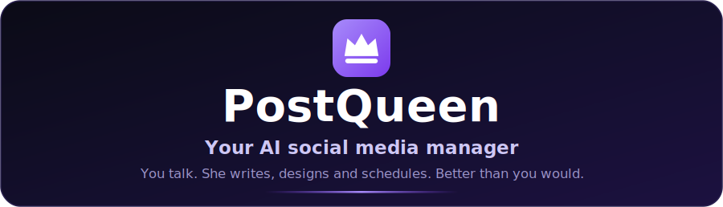
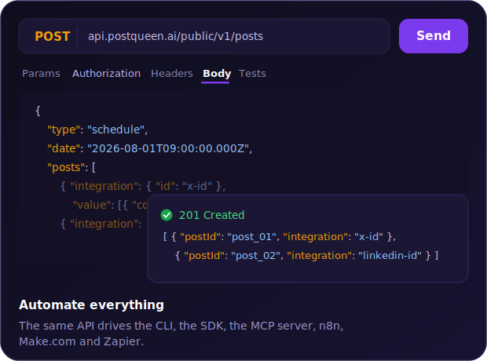

<p align="center">
  <a href="https://postqueen.ai">
    
  </a>
</p>

<h3 align="center">
  <a href="https://postqueen.ai/agent">🆕 NEW: meet the PostQueen Agent, run your social media from Claude Code, ChatGPT, OpenClaw or Hermes »</a>
</h3>

<br/>

<p align="center">
  <strong>Everything PostQueen, documented.</strong>
</p>

<p align="center">
  This repository is the source of <a href="https://docs.postqueen.ai">docs.postqueen.ai</a>: self-hosting, configuration, per-network provider guides, the CLI, MCP and the full public API.
</p>

<br/>

<p align="center">
  <a href="https://postqueen.ai">Website</a> &nbsp;·&nbsp;
  <a href="https://postqueen.ai/pricing">Pricing</a> &nbsp;·&nbsp;
  <a href="https://docs.postqueen.ai">Docs</a> &nbsp;·&nbsp;
  <a href="https://api.postqueen.ai/docs">API Reference</a> &nbsp;·&nbsp;
  <a href="https://postqueen.ai/agent">Agents</a> &nbsp;·&nbsp;
  <a href="https://postqueen.ai/mcp">MCP</a> &nbsp;·&nbsp;
  <a href="https://www.npmjs.com/package/postqueen">CLI</a>
</p>

<p align="center">
  <a href="https://github.com/GkhanKINAY/postqueen-docs/blob/main/LICENSE"></a>
  <a href="https://www.npmjs.com/package/postqueen"></a>
  <a href="https://www.npmjs.com/package/@postqueen/node"></a>
  <a href="https://www.npmjs.com/package/n8n-nodes-postqueen"></a>
</p>

<p align="center">
                               
</p>

---

## 📚 Read the docs

**The docs live at [docs.postqueen.ai](https://docs.postqueen.ai).** That is the rendered, searchable version of everything in this repo. Here is the map:

| Section | What you will find | Start at |
| --- | --- | --- |
| Getting started | What PostQueen is and your first post | [/introduction](https://docs.postqueen.ai/introduction) · [/quickstart](https://docs.postqueen.ai/quickstart) · [/howitworks](https://docs.postqueen.ai/howitworks) |
| Self-hosting | Docker Compose, plain Docker, Kubernetes, system requirements | [/installation/docker-compose](https://docs.postqueen.ai/installation/docker-compose) · [/installation/kubernetes-helm](https://docs.postqueen.ai/installation/kubernetes-helm) |
| Configuration | Every environment variable and integration setting | [/configuration/reference](https://docs.postqueen.ai/configuration/reference) |
| Providers | Per-network OAuth app setup guides (X, LinkedIn, Instagram, TikTok and more) | [/providers/overview](https://docs.postqueen.ai/providers/overview) |
| CLI | The `postqueen` command line for scripts and AI agents | [/cli/introduction](https://docs.postqueen.ai/cli/introduction) |
| MCP | Connect AI assistants over the Model Context Protocol | [/mcp/introduction](https://docs.postqueen.ai/mcp/introduction) |
| Public API | 22 REST endpoints with examples | [/public-api/introduction](https://docs.postqueen.ai/public-api/introduction) |
| Reverse proxies | Caddy, nginx, Traefik recipes for HTTPS | [/reverse-proxies/caddy](https://docs.postqueen.ai/reverse-proxies/caddy) |
| Troubleshooting | Fixes for the common failure modes | [/troubleshooting/overview](https://docs.postqueen.ai/troubleshooting/overview) |

The docs also ship `llms.txt` and `llms-full.txt`, so AI assistants can pull the whole site in one request. Mintlify serves both automatically.

---

## 🚀 API quick taste

The public API lives at `https://api.postqueen.ai/public/v1`. Authentication is one header: `Authorization`, set to your raw API key, with no `Bearer` prefix.

<p align="center">
  
</p>

```bash
curl https://api.postqueen.ai/public/v1/integrations \
  -H "Authorization: $POSTQUEEN_API_KEY"
```

That is the whole handshake. The full reference, every endpoint and every per-network settings schema, is at [docs.postqueen.ai/public-api/introduction](https://docs.postqueen.ai/public-api/introduction), and you can try calls live in the Swagger playground at [api.postqueen.ai/docs](https://api.postqueen.ai/docs).

---

## 🖥️ Run these docs locally

This site is built with [Mintlify](https://mintlify.com):

```bash
npm i -g mint     # install the Mintlify CLI
mint dev          # serve the docs at http://localhost:3000
```

`docs.json` defines the navigation; every page is an `.mdx` file in this repo.

---

## ✍️ Contributing

Fixes and clarifications are welcome. Spot a typo, a stale flag or a missing step? Open a PR: the site deploys from this repo, so merged changes go straight to [docs.postqueen.ai](https://docs.postqueen.ai).

Want to contribute to the app itself? Start with the [developer guide](https://docs.postqueen.ai/developer-guide).

---

## ❤️ Community and support

- 🐛 **Found a bug or have an idea?** [Open an issue](https://github.com/GkhanKINAY/postqueen-docs/issues).
- 💌 **Need a hand?** Email **support@postqueen.ai**.
- 📚 **Getting started?** The [docs](https://docs.postqueen.ai) walk you through everything.

If PostQueen saves you time, a ⭐ on the repo genuinely helps other people find it.

---

## 👑 The PostQueen ecosystem

| Repository | What lives there |
| --- | --- |
| [postqueen-app](https://github.com/GkhanKINAY/postqueen-app) | The application itself: frontend, backend, workers |
| [postqueen-agent](https://github.com/GkhanKINAY/postqueen-agent) | Agent CLI and skill: give any AI assistant hands |
| [postqueen-docker-compose](https://github.com/GkhanKINAY/postqueen-docker-compose) | Self-host the whole stack with one command |
| [postqueen-helmchart](https://github.com/GkhanKINAY/postqueen-helmchart) | Run it on Kubernetes |
| [postqueen-n8n](https://github.com/GkhanKINAY/postqueen-n8n) | The n8n community node for no-code automation |
| [postqueen-docs](https://github.com/GkhanKINAY/postqueen-docs) | Source of [docs.postqueen.ai](https://docs.postqueen.ai) |

On npm: [`postqueen`](https://www.npmjs.com/package/postqueen) (CLI) · [`@postqueen/node`](https://www.npmjs.com/package/@postqueen/node) (SDK) · [`n8n-nodes-postqueen`](https://www.npmjs.com/package/n8n-nodes-postqueen) (n8n)

PostQueen is a fork of [Postiz](https://github.com/gitroomhq/postiz-app) by Nevo David, released under AGPL-3.0. Thank you, Nevo David and every Postiz contributor: this project exists because you open-sourced yours. The full story is in the [main README](https://github.com/GkhanKINAY/postqueen-app#-thank-you-postiz).

## License

This repository is available under the [MIT license](LICENSE) (the Mintlify docs template license).

Original work © Nevo David / Gitroom and the Postiz contributors. Modifications © PostQueen.
