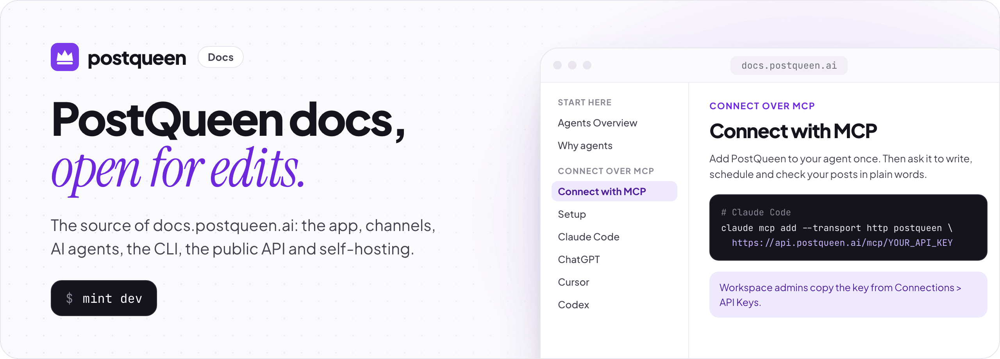

<p align="center">
  <picture>
    <source media="(prefers-color-scheme: dark)" srcset=".github/assets/banner-dark.png">
    
  </picture>
</p>

<p align="center">
  The source of <a href="https://docs.postqueen.ai/introduction">docs.postqueen.ai</a>, the documentation for PostQueen, built with <a href="https://mintlify.com">Mintlify</a>.
</p>

<p align="center">
  <a href="https://postqueen.ai"><b>Website</b></a> ·
  <a href="https://docs.postqueen.ai/introduction"><b>Docs</b></a> ·
  <a href="https://postqueen.ai/pricing"><b>Pricing</b></a> ·
  <a href="https://api.postqueen.ai/docs"><b>API reference</b></a>
</p>

<p align="center">
  <a href="LICENSE"></a>
  <a href="https://mintlify.com"></a>
</p>

PostQueen is a social media scheduler with an AI copilot. It schedules posts to 30+ networks from the app, from AI agents over MCP, from the `postqueen` CLI and from the public API.

## What it covers

| Section | What you will find | Start at |
| --- | --- | --- |
| Getting started | What PostQueen is and how to publish your first post | [/introduction](https://docs.postqueen.ai/introduction) · [/quickstart](https://docs.postqueen.ai/quickstart) |
| Using the app | The calendar, the composer, analytics, teams and settings | [/using/calendar](https://docs.postqueen.ai/using/calendar) |
| Channels | How each network connects and what it supports | [/providers/overview](https://docs.postqueen.ai/providers/overview) |
| Plans and trial | The hosted service's plans, trial and limits | [/cloud/overview](https://docs.postqueen.ai/cloud/overview) |
| AI agents and MCP | Connecting Claude, ChatGPT, Cursor, Codex and other agents | [/agents/overview](https://docs.postqueen.ai/agents/overview) · [/mcp/introduction](https://docs.postqueen.ai/mcp/introduction) |
| CLI | The `postqueen` command line | [/cli/introduction](https://docs.postqueen.ai/cli/introduction) |
| Public API | How to authenticate, and the main endpoints with examples | [/public-api/introduction](https://docs.postqueen.ai/public-api/introduction) |
| Self-hosting | Docker Compose, Kubernetes, configuration and reverse proxies | [/installation/overview](https://docs.postqueen.ai/installation/overview) · [/configuration/reference](https://docs.postqueen.ai/configuration/reference) |
| Troubleshooting | Common failures and how to fix them | [/troubleshooting/overview](https://docs.postqueen.ai/troubleshooting/overview) |

The site also serves [`llms.txt`](https://docs.postqueen.ai/llms.txt) and `llms-full.txt`, so AI assistants can read the whole site in one request.

## Quick start

Run the site locally:

```bash
npm i -g mint
mint dev                          # serves the docs at http://localhost:3000
python3 scripts/check-docs.py     # checks navigation, internal links and the User Guide rules
```

Every page is an `.mdx` file in this repository, and [`docs.json`](docs.json) defines the navigation.

## Contributing

1. Edit or add the `.mdx` page. A new page also needs an entry in `docs.json`.
2. Run `python3 scripts/check-docs.py`. The same check runs on every push and pull request.
3. Open a pull request. Merged changes deploy to docs.postqueen.ai.

Report a mistake in the docs as an issue here. Report a bug in the app itself on [postqueen-app](https://github.com/GkhanKINAY/postqueen-app/issues).

## Privacy and security

- Channels connect through each network's official OAuth sign-in where the network offers one.
- Some networks, such as Bluesky, Lemmy, WordPress and Nostr, need an app password, an account password or a key that you paste in.
- PostQueen stores these credentials so it can post for you, and replaces them when you remove the channel.
- Read the [privacy policy](https://postqueen.ai/privacy-policy), or [delete your account](https://postqueen.ai/delete-my-account).

## Links

| | |
| --- | --- |
| Docs | [docs.postqueen.ai](https://docs.postqueen.ai/introduction) |
| Hosted service | [postqueen.ai](https://postqueen.ai) · [pricing](https://postqueen.ai/pricing) |
| API reference | [api.postqueen.ai/docs](https://api.postqueen.ai/docs) |
| Repositories | [app](https://github.com/GkhanKINAY/postqueen-app) · [CLI and skill](https://github.com/GkhanKINAY/postqueen-agent) · [n8n node](https://github.com/GkhanKINAY/postqueen-n8n) · [docs](https://github.com/GkhanKINAY/postqueen-docs) · [Docker Compose](https://github.com/GkhanKINAY/postqueen-docker-compose) · [Helm chart](https://github.com/GkhanKINAY/postqueen-helmchart) |
| Help | support@postqueen.ai · [GitHub issues](https://github.com/GkhanKINAY/postqueen-docs/issues) |

## License

These docs are open source under the [MIT license](LICENSE), from the Mintlify docs template. PostQueen started as a fork of [Postiz](https://github.com/gitroomhq/postiz-app) by Nevo David, and this repository started from [postiz-docs](https://github.com/gitroomhq/postiz-docs). Original work © Nevo David / Gitroom and the Postiz contributors. Modifications © PostQueen.
