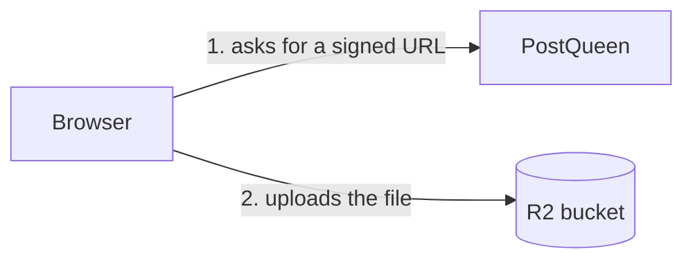
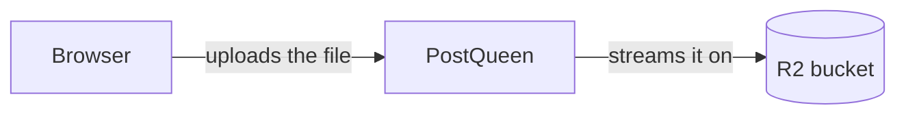

PostQueen writes user-uploaded media (post images, avatars, generated
content) through a single storage abstraction. Pick one of two backends.

## Pick a backend

```env
STORAGE_PROVIDER="local"      # default: write to local filesystem
# or
STORAGE_PROVIDER="cloudflare" # write to Cloudflare R2
```

## Local filesystem

Set the path where PostQueen should write:

```env
STORAGE_PROVIDER="local"
UPLOAD_DIRECTORY="/data/postqueen/uploads"
NEXT_PUBLIC_UPLOAD_STATIC_DIRECTORY="uploads"
```

- `UPLOAD_DIRECTORY`: the directory files are written to on disk.
- `NEXT_PUBLIC_UPLOAD_STATIC_DIRECTORY`: the URL path segment used to
  reference those files, **with no leading slash**. Default `uploads`.
  It is joined after a slash that is already there, so writing
  `/uploads` gives you a double slash in every media URL.

Set `STORAGE_PROVIDER` explicitly. Writing falls back to `local`, but
the rewrite that serves the files tests for the literal string `local`,
so an unset value uploads happily and then 404s every image.

### Who actually serves the files

Not the backend, which is the part most people get wrong when they
mount the volume.

On the official image, nginx serves `/uploads/` straight off the
container filesystem, from the hard-coded path `/uploads`. Running from
source, Next.js rewrites `/uploads/:path*` to its own
`/api/uploads/:path*` route handler, which reads `UPLOAD_DIRECTORY`
from the frontend process's own disk.

Either way the **frontend** is what reads the directory. Mount the
volume where the frontend can see it, and on the official image leave
`UPLOAD_DIRECTORY` at `/uploads`, because that is the path nginx is
compiled to serve.

### Docker volume mount

In `docker-compose.yaml`:

```yaml
services:
  postqueen:
    environment:
      STORAGE_PROVIDER: "local"
      UPLOAD_DIRECTORY: "/uploads"
      NEXT_PUBLIC_UPLOAD_STATIC_DIRECTORY: "uploads"
    volumes:
      - postqueen-uploads:/uploads

volumes:
  postqueen-uploads:
```

If you scale beyond one backend replica, you need a shared volume, or
switch to Cloudflare R2.

### Caveat: some providers need public HTTPS URLs

TikTok (and a few others) fetch media via "pull from URL" rather than
multipart upload. Your local `/uploads` path must therefore be
reachable from the public internet over HTTPS for those providers to
work. If your deployment is internet-facing through a reverse proxy
with TLS, you are fine. If PostQueen is on a private network, those
providers will fail and you should use [Cloudflare R2](/configuration/r2)
or a CDN instead.

## Cloudflare R2

Set `STORAGE_PROVIDER=cloudflare` and configure the R2 credentials. See
the dedicated [R2 setup guide](/configuration/r2) for the OAuth and
bucket-permissions walkthrough.

```env
STORAGE_PROVIDER="cloudflare"
CLOUDFLARE_ACCOUNT_ID="…"
CLOUDFLARE_ACCESS_KEY="…"
CLOUDFLARE_SECRET_ACCESS_KEY="…"
CLOUDFLARE_BUCKETNAME="…"
CLOUDFLARE_BUCKET_URL="https://pub-your-hash.r2.dev"
CLOUDFLARE_REGION="auto"
# Only if you created the bucket with a jurisdiction, e.g. "eu"
CLOUDFLARE_JURISDICTION=""
```

`CLOUDFLARE_BUCKET_URL` is the address browsers and social networks fetch from.
It must never be the `…r2.cloudflarestorage.com` S3 endpoint, which serves
nothing without a signature. You have three choices for it — a custom domain,
the r2.dev URL, or PostQueen serving the media itself — compared in the
[R2 setup guide](/configuration/r2#decide-where-media-is-read-from).

Any of them gives you a public HTTPS address, so the TikTok caveat above does
not apply.

### Two ways an upload can travel

By default the browser sends the file **straight to the bucket**, using a URL
the backend signs for it. The file never passes through your server:



With `UPLOAD_VIA_SERVER=true` the file is posted to PostQueen, which writes it
to the bucket itself:



The first is faster and costs you no bandwidth. The second is sturdier: nothing
between the browser and the bucket can interfere, and it lets the bucket stay
private. The next section is what "interfere" looks like in practice.

Either way the size limit is the same — **1 GB per file**, enforced while the
upload is being read rather than after it finishes. What a social network will
publish is far smaller and decided by the network, not by this.

### When uploads fail with a CORS error

With R2, the browser uploads to the bucket directly using a URL the backend
signs for it. That signature covers the URL's query parameters, so if anything
alters the request between the browser and R2 — a privacy extension stripping
what it takes for tracking parameters, a corporate proxy — the signature no
longer matches and R2 answers `403`.

R2 leaves CORS headers off its error responses, so the browser cannot read that
`403` and reports it as:

```
blocked by CORS policy: No 'Access-Control-Allow-Origin' header is present
```

which points at CORS while the actual cause is elsewhere. The tell is that the
backend's own requests all succeed: `create-multipart-upload` and `sign-part`
return `200`, then `abort-multipart-upload` follows after a few retries.

Setting `UPLOAD_VIA_SERVER=true` sidesteps it. Files are posted to the backend,
which writes them to R2 itself, so nothing between the browser and the bucket
can invalidate anything. Uploads are spooled to disk rather than held in memory
and deleted once stored, so a large video does not become a memory spike.

```env
UPLOAD_VIA_SERVER="true"
```

The trade is bandwidth: every upload now travels through your server twice
instead of going straight to storage.

### Serving media from your own domain

Point `CLOUDFLARE_BUCKET_URL` at your own host and PostQueen serves the media
itself:

```env
CLOUDFLARE_BUCKET_URL="https://your-host/api/uploads"
```

It reads each file from R2 over the S3 API and streams it back, cached for a
year — object names are random and nothing is ever overwritten, so there is
nothing to invalidate. That buys you your own domain, no rate limit, no DNS
changes, and a bucket that can stay **entirely private**: switch its public
access off and nothing reaches it except your server.

The cost is bandwidth, since media leaves through your server rather than the
bucket's edge. Note the `/api` prefix — nginx inside the container maps
`/uploads/` to a local directory, so only `/api/uploads` reaches the backend.

The other two options, and when each makes sense, are in the
[R2 setup guide](/configuration/r2#decide-where-media-is-read-from).

<Warning>
Use a bucket that holds **only** PostQueen media. This endpoint is public by
necessity — the social networks fetch it with no session — so anything in that
bucket is potentially reachable. It will only serve objects whose names match
what PostQueen itself writes (a random name plus an image, video or audio
extension), which keeps a stray backup or export out of reach, but a dedicated
bucket is the setup to aim for.
</Warning>

## Public-API uploads

Both `/public/v1/upload` and `/public/v1/upload-from-url` write through
the configured `STORAGE_PROVIDER`. The accepted MIME types and body-size
limits are documented in [troubleshooting/uploads](/troubleshooting/uploads).
