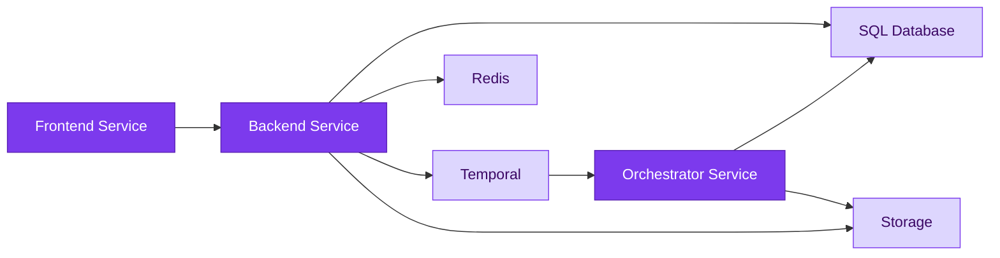

PostQueen may feel like one app from the outside, but under the hood she is a small, well-coordinated team of services. Here is how they fit together.

## Architecture

PostQueen is composed of 3 main services and 4 external services. All 3 of the main services typically run within a **single Docker container**, and talk to each other through HTTP. Those services talk to other containers that run the external services described below.

- [Frontend](#frontend): Provides the Web user interface, talks to the Backend.
- [Backend](#backend): Does all the real work, provides an API for the frontend, and triggers workflows via Temporal.
- [Orchestrator](#orchestrator): Runs Temporal workflows and activities, replacing the old cron and worker services.

- [Temporal](#temporal): A durable workflow engine that manages scheduling, retries, and task distribution.
- **Redis**: Used for caching and queues.
- **SQL Database**: Stores all the data. Postgres is typically used, but other SQL databases can work too.
- **Storage**: Stores all the files. Cloudflare R2 used to be the default, but now it is a local file system.

### Frontend

The frontend is the part that you see, the web interface.

It relies on the backend to:

- Schedule posts
- Show analytics
- Manage users

### Backend

The backend is the "brain" of PostQueen, and coordinates all the work. It triggers Temporal workflows for async operations like posting to social media, sending emails, and refreshing tokens. Typically the SQL database it talks to is Postgres, but other databases can be used.

### Orchestrator

The orchestrator replaces the old cron and worker services with Temporal workflows. It handles:

- Posting scheduled content to social media platforms.
- Refreshing tokens from different social media platforms.
- Sending digest and notification emails.
- Checking for missing posts and auto-posting.
- Tracking user posting streaks.

### Temporal

Temporal is a durable workflow execution engine. It provides:

- **Reliable scheduling**: Workflows run at the right time with automatic retries on failure.
- **Task queues**: Each social platform gets its own task queue for concurrency control.
- **Workflow visibility**: A built-in UI for monitoring and debugging workflow execution.
- **Durable state**: Workflow state is persisted, so workflows pick up where they left off after a restart.

