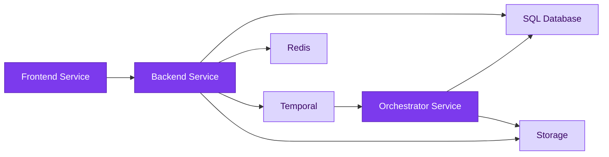

You say one thing before your first coffee, then close the laptop. Everything after that is hers. Four beats, every time:

1. **You say it once**, from the app, a chat or your terminal.
2. **She does the work**: research, copy shaped to each platform, and an image or video to match.
3. **The calendar is yours**: let it run on autopilot, edit anything before it goes out, or ask for drafts and approve each post yourself.
4. **It goes out on time**, every time. She fires each post exactly when planned and retries on failure, because [Temporal](#temporal) is holding the clock and quietly refreshing your platform tokens in the background.

From the outside she is one app with one calendar. Inside, she is a small team of services, and the handoffs between them are what make a 9 AM post actually leave at 9 AM.

## Architecture

Three services do her own work, and four more back them up. In most installs those three share a **single Docker container** and talk to each other through HTTP. The supporting services run alongside them, usually in containers of their own.

```mermaid
flowchart LR;
    classDef ext fill:#ddd6fe,color:#3b0764,stroke:#7c3aed
    classDef svc fill:#7c3aed,color:#ffffff,stroke:#5b21b6

    frontend[Frontend Service]:::svc
    backend[Backend Service]:::svc
    orchestrator[Orchestrator Service]:::svc
    temporal[Temporal]:::ext
    redis[Redis]:::ext
    db[SQL Database]:::ext
    storage[Storage]:::ext

    frontend --> backend
    backend --> db
    backend --> redis
    backend --> temporal
    temporal --> orchestrator
    orchestrator --> db
    orchestrator --> storage
    backend --> storage

```

Her own three:

- [Frontend](#frontend)
- [Backend](#backend)
- [Orchestrator](#orchestrator)

The four that back them up:

- [Temporal](#temporal), which runs the schedule.
- **Redis**, for caching and queues.
- **SQL Database**, which stores all the data. Postgres is the usual choice, and other SQL databases can work too.
- **Storage**, which holds your media files. The default is the local file system, and Cloudflare R2 or another S3-compatible store can take over.

### Frontend

You drag a post from Tuesday to Thursday and it sticks. The calendar, the editor and the analytics screens are the part you touch, and none of it lives in your browser. Everything on those screens comes from the backend, whether you are scheduling a post, reading your numbers or adding someone to your team.

### Backend

A post you save at 2 PM is written down before the toast finishes fading. This is her brain, and it coordinates all the work. Anything slow goes to Temporal as a workflow: publishing a post, sending an email, refreshing a platform token. Everything else it writes down in the SQL database, usually Postgres.

### Orchestrator

A post you set for Thursday at 9 AM sits here until Thursday at 9 AM. Its Temporal workflows took over the jobs that used to run on cron and worker processes:

- Posting scheduled content to social media platforms.
- Refreshing tokens from different social media platforms.
- Sending digest and notification emails.
- Checking for missing posts and auto-posting.
- Tracking user posting streaks.

### Temporal

Schedule a post three weeks out, restart the server twice in between, and it still fires on the right minute. Temporal is a durable workflow execution engine, and that is what you get from it:

- **Reliable scheduling**: Workflows run at the right time with automatic retries on failure.
- **Task queues**: Each social platform gets its own task queue for concurrency control.
- **Workflow visibility**: A built-in UI for monitoring and debugging workflow execution.
- **Durable state**: Workflow state is persisted, so workflows pick up where they left off after a restart.
