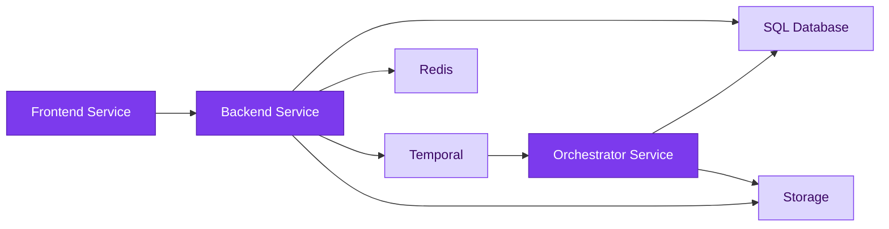

You say it once. Everything after that is hers:

1. **You say it once**, from the app, a chat or your terminal.
2. **She does the work**: research, copy shaped to each platform, and an image or video to match.
3. **The calendar is yours**: let it run on autopilot, edit anything before it goes out, or ask for drafts and publish them yourself.
4. **It goes out on time**, every time. She fires each post exactly when planned and retries on failure, because [Temporal](#temporal) is holding the clock and quietly refreshing your platform tokens in the background.

<Frame>
  
</Frame>

From the outside she is one app with one calendar. Inside, she is a small team of services, and the handoffs between them are what make a 9 AM post actually leave at 9 AM.

## Architecture

Three services do her own work, and four more back them up. In most installs those three share a **single Docker container** and talk to each other through HTTP. The supporting services run alongside them, usually in containers of their own.

```mermaid
flowchart LR;
    classDef ext fill:#ddd6fe,color:#3b0764,stroke:#7c3aed
    classDef svc fill:#7c3aed,color:#ffffff,stroke:#5b21b6

    frontend[Frontend Service]:::svc
    backend[Backend Service]:::svc
    orchestrator[Orchestrator Service]:::svc
    temporal[Temporal]:::ext
    redis[Redis]:::ext
    db[SQL Database]:::ext
    storage[Storage]:::ext

    frontend --> backend
    backend --> db
    backend --> redis
    backend --> temporal
    temporal --> orchestrator
    orchestrator --> db
    orchestrator --> storage
    backend --> storage

```

| Service | What it does | Hers? |
|---|---|---|
| **Frontend** | The calendar, editor and analytics screens. None of it lives in your browser; every screen comes from the backend | yes |
| **Backend** | Her brain. Writes everything down and hands anything slow to Temporal | yes |
| **Orchestrator** | Runs those workflows when their moment arrives | yes |
| **Temporal** | Holds the clock, retries failures, refreshes platform tokens | no |
| **Redis** | Caching and queues | no |
| **SQL database** | All your data. Postgres is the usual choice | no |
| **Storage** | Your media files. Local disk by default, or [Cloudflare R2](/configuration/r2) | no |

<AccordionGroup>
  <Accordion title="What the orchestrator actually runs" icon="gears">
    Temporal workflows took over the jobs that used to run on cron and worker processes:

    - Posting scheduled content to the platforms
    - Refreshing platform tokens
    - Sending digest and notification emails
    - Checking for missing posts and auto-posting
    - Tracking posting streaks
  </Accordion>

  <Accordion title="Why Temporal and not a cron job" icon="clock">
    Schedule a post three weeks out, restart the server twice in between, and it still fires on the right minute.

    - **Durable state.** Workflow state is persisted, so a workflow picks up where it left off after a restart
    - **Retries.** A failure is retried rather than dropped
    - **Task queues.** Each platform gets its own, for concurrency control
    - **Visibility.** A built-in UI for watching and debugging runs
  </Accordion>
</AccordionGroup>
