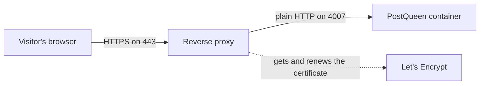

If you followed [Deploy to a server](/installation/production), PostQueen is running but only
answers on the server itself, on port 4007. This page is the last piece: giving her your
domain name and a certificate, so people can reach her at `https://postqueen.example.com`.

## What a reverse proxy is

A reverse proxy is a small program that sits in front of your app. It takes requests from the
internet on the standard web ports, handles the HTTPS certificate, and passes each request
along to the app running quietly on a local port.

You need one because PostQueen does not manage certificates herself, and because you do not
want her port open to the world.



The proxy is also where the certificate lives, which is why the tools below can obtain and
renew one for you automatically. You never handle certificate files by hand.

## Why HTTPS is not optional here

This is not a general recommendation. Two things genuinely stop working without it.

**Sign-in.** PostQueen marks her login cookies as secure, which is a browser rule meaning the
cookie is only sent over an encrypted connection. Over plain HTTP the browser refuses to store
it, so signing in appears to succeed and then immediately does not.

**Connecting channels.** Several networks, including Slack, TikTok, Threads and Instagram,
reject a plain HTTP return address outright when you connect an account. She works around it
in development by routing those redirects through a public helper service, and that workaround
disappears the moment your address is HTTPS, which is where you want to be anyway.

<Warning>
There is an escape hatch, `NOT_SECURED=true`, which drops the cookie protections so plain HTTP
works. It exists for local development. Setting it on a server that other people reach means
session cookies travel in the clear, so do not.
</Warning>

## Which proxy should you use

<CardGroup cols={2}>
  <Card title="Caddy" icon="feather" href="/reverse-proxies/caddy">
    **Pick this if you have no preference.** Three lines of configuration, and it gets and
    renews your certificate on its own with nothing to schedule.
  </Card>
  <Card title="Nginx" icon="server" href="/reverse-proxies/nginx">
    The one most people have heard of. More configuration, and certificates are a separate
    tool. Sensible if you already run it.
  </Card>
  <Card title="Traefik" icon="network-wired" href="/reverse-proxies/traefik">
    Configured with labels on the container rather than a file. Natural if you already run it
    in front of your other containers.
  </Card>
  <Card title="Something else" icon="circle-question" href="/reverse-proxies/websockets-and-dev">
    Cloudflare Tunnel, a load balancer, a split deployment. What any proxy has to get right.
  </Card>
</CardGroup>

## Which port to send traffic to

This trips people up, so it is worth being exact.

| How you installed her | Send the proxy to |
| --- | --- |
| [Docker Compose](/installation/docker-compose), the normal path | `localhost:4007` |
| [Docker on its own](/installation/docker) | `localhost:5000` |
| Traefik, which reaches the container over the container network | port `5000` on the service |

Inside the container she always listens on **5000**. The Compose file publishes that as
**4007** on the host, which is why the number your proxy needs depends on how you started her.
Traefik is the exception because it talks to the container directly rather than through the
host, so it uses 5000 even under Compose.

## Tell her about her own address

Setting up the proxy is only half of it. She also has to know what address people use, because
she builds sign-in origins and every social network's return address from it. In
`docker-compose.yaml`:

```yaml
MAIN_URL: 'https://postqueen.example.com'
FRONTEND_URL: 'https://postqueen.example.com'
NEXT_PUBLIC_BACKEND_URL: 'https://postqueen.example.com/api'
BACKEND_INTERNAL_URL: 'http://localhost:3000'
```

Three rules that cover nearly every problem people hit here:

- **No trailing slashes.** She flags them at startup and they break comparisons.
- **`NEXT_PUBLIC_BACKEND_URL` keeps the `/api` suffix.** Everything arrives on one address, and
  that path is how the internal proxy knows to send a request to the backend.
- **`BACKEND_INTERNAL_URL` stays `http://localhost:3000`.** It is not a public address. It is
  how the web interface reaches the backend inside the same container, and changing it to your
  domain sends that traffic on a pointless round trip through the internet, if it works at all.

Apply the change with `docker compose down` and then `docker compose up -d`. A plain restart
keeps the old values.

## Check that it worked

From your own machine, not the server:

```bash
curl -I https://postqueen.example.com
```

`HTTP/2 200` means the proxy, the certificate and PostQueen are all doing their jobs. Then open
the address in a browser and sign in. If the page loads but sign-in does not stick, the
certificate is fine and the URL settings above are what to check.

## Next Steps

<Snippet file="next-steps-selfhost.mdx" />
