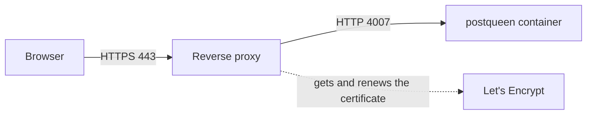

import ComposePublicUrls from '/snippets/compose-public-urls.mdx';
import RestartService from '/snippets/restart-service.mdx';
import NextStepsSelfhost from '/snippets/next-steps-selfhost.mdx';

PostQueen does not handle certificates itself. A reverse proxy in front of it accepts HTTPS on port 443, holds the certificate, and passes each request to PostQueen on a local port. This page sets one up with Caddy, which gets and renews the certificate on its own, and then tells PostQueen its public address.



## Why HTTPS is required

- **Sign-in.** The login cookie is marked `Secure`, so the browser sends it only over HTTPS. Over plain HTTP, signing in looks like it works and the next page is the login page again.
- **Connecting channels.** Most networks accept only an `https` redirect address. On a plain `http` address, PostQueen sends Slack, TikTok, TikTok Business, Threads, Instagram (Standalone) and VK through the public `redirectmeto.com` service to satisfy them. That helper is for local testing, and it drops out as soon as your address is `https`.

`NOT_SECURED=true` removes the cookie requirement for a local try. On a server other people reach, it sends session cookies in the clear: do not set it there.

## Which port the proxy sends to

| How PostQueen runs | Send the proxy to |
|---|---|
| [Docker Compose](/installation/docker-compose), the usual install | `localhost:4007` |
| The image on its own, with `-p 127.0.0.1:5000:5000` | `localhost:5000` |
| A proxy on the same Docker network, such as [Traefik](/reverse-proxies/traefik) | the `postqueen` service, port `5000` |

Inside the container PostQueen always listens on 5000. Compose publishes that as 4007 on the host.

## Set up Caddy

Before you start, the domain's **A record** has to point at the server (`dig +short postqueen.example.com` prints its IP), and ports 80 and 443 have to be open. Caddy uses port 80 to prove it controls the domain.

<Steps>
  <Step title="Install Caddy">
    On Ubuntu or Debian, from Caddy's own package repository:

    ```bash
    sudo apt install -y debian-keyring debian-archive-keyring apt-transport-https curl
    curl -1sLf 'https://dl.cloudsmith.io/public/caddy/stable/gpg.key' | sudo gpg --dearmor -o /usr/share/keyrings/caddy-stable-archive-keyring.gpg
    curl -1sLf 'https://dl.cloudsmith.io/public/caddy/stable/debian.deb.txt' | sudo tee /etc/apt/sources.list.d/caddy-stable.list
    sudo chmod o+r /usr/share/keyrings/caddy-stable-archive-keyring.gpg
    sudo chmod o+r /etc/apt/sources.list.d/caddy-stable.list
    sudo apt update
    sudo apt install caddy
    ```

    Other systems are on [Caddy's install page](https://caddyserver.com/docs/install). The package runs Caddy as a systemd service.
  </Step>
  <Step title="Write the Caddyfile">
    Replace everything in `/etc/caddy/Caddyfile` with:

    ```caddy /etc/caddy/Caddyfile
    postqueen.example.com {
        reverse_proxy localhost:4007
    }
    ```

    That is the whole configuration. Caddy sees a public name and requests a certificate for it. It sets the forwarding headers, does not cap upload size and streams responses as they arrive, so PostQueen needs nothing more.
  </Step>
  <Step title="Reload Caddy">
    ```bash
    sudo systemctl reload caddy
    sudo journalctl -u caddy -f
    ```

    Wait for a line with `certificate obtained successfully`, then press `Ctrl+C`.
  </Step>
</Steps>

On a private network where Let's Encrypt cannot reach the name, add `tls internal` inside the block. Caddy then issues its own certificate, which browsers trust only after you install Caddy's local authority on each device: see [Caddy's local HTTPS](https://caddyserver.com/docs/automatic-https#local-https).

Already run another proxy? [Nginx](/reverse-proxies/nginx) and [Traefik](/reverse-proxies/traefik) have their own pages, and [Split deployments](/reverse-proxies/split-deployments) covers the paths any proxy must route when the frontend and backend run apart.

## Tell PostQueen its address

The proxy alone is not enough. PostQueen builds its allowed origins, email links and every network's redirect address from these values.

<ComposePublicUrls />

Three rules cover most problems:

- **No trailing slashes.** The backend logs `should not end with /` at startup for each one.
- **`FRONTEND_URL` is exactly the browser's address**, with `https://`, the same host and no path. The backend accepts browser requests only from `FRONTEND_URL` and `MAIN_URL`.
- **`NEXT_PUBLIC_BACKEND_URL` keeps `/api`.** Inside the container, nginx sends everything under `/api/` to the backend.

Apply it:

<RestartService />

## Check it

From your own computer:

```bash
curl -I https://postqueen.example.com
```

<Check>
`HTTP/2 200`, then a sign-in in the browser that holds on the next page.
</Check>

## If it does not work

<AccordionGroup>
  <Accordion title="Caddy does not get a certificate">
    The name does not resolve to this server yet, or port 80 is blocked. `sudo journalctl -u caddy -n 50` usually names the reason.
  </Accordion>
  <Accordion title="502 Bad Gateway">
    Caddy runs, PostQueen does not answer. On the server, `curl -I http://localhost:4007` tells you whether it is up, and `docker compose logs postqueen` why not.
  </Accordion>
  <Accordion title="The page loads, sign-in does not stick">
    `FRONTEND_URL` does not match the address in the browser, character for character. Fix the value and recreate the container.
  </Accordion>
  <Accordion title="A large upload fails">
    Caddy sets no size limit. PostQueen accepts files up to 1 GB each, and larger ones are refused by PostQueen itself.
  </Accordion>
</AccordionGroup>

## Next steps

<NextStepsSelfhost />
