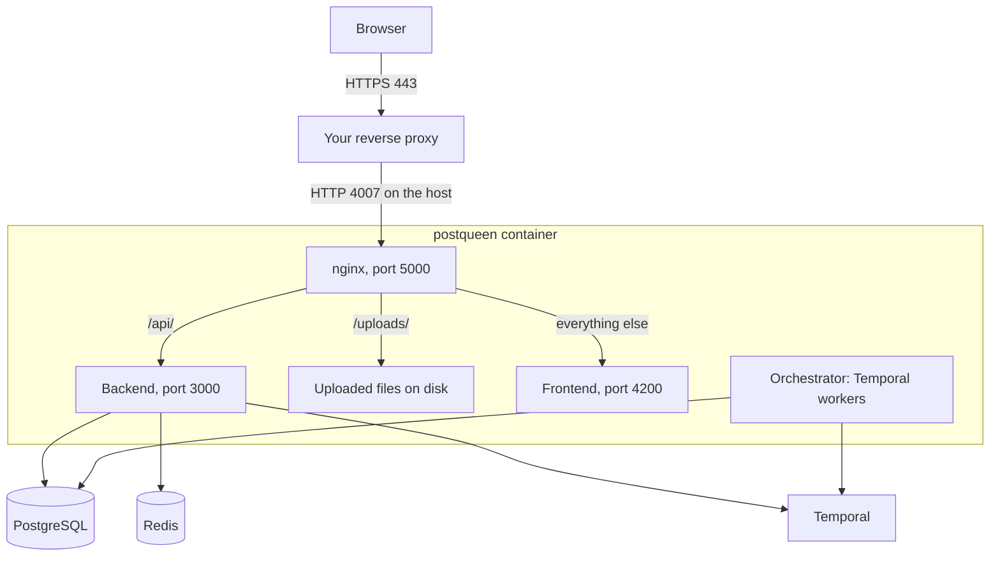

import NextStepsSelfhost from '/snippets/next-steps-selfhost.mdx';

PostQueen runs as one container image next to three services: PostgreSQL, Redis and Temporal. The official Docker Compose file starts all four, so a working install is a clone, a short `.env` file and one command.

This page covers what runs, what the machine needs and which guide to follow. To start right away, go to [Try it locally](/installation/quickstart-local) or [Deploy to a server](/installation/production).

## Pick a path

<CardGroup cols={2}>
  <Card title="Try it locally" icon="laptop" href="/installation/quickstart-local">
    Docker Compose on your own computer, over plain HTTP. About five minutes, and one command removes it.
  </Card>
  <Card title="Deploy to a server" icon="server" href="/installation/production">
    Docker Compose on a virtual machine, on your own domain, with HTTPS. The path for an install other people use.
  </Card>
  <Card title="Kubernetes with Helm" icon="ship-wheel" href="/installation/kubernetes-helm">
    The Helm chart, for a cluster you already run. You bring the Temporal server.
  </Card>
  <Card title="Run from source" icon="code" href="/installation/development">
    Hot reload for changing the code, with a dev container if you prefer.
  </Card>
</CardGroup>

[Docker Compose](/installation/docker-compose) is the reference for the Compose file itself, and it also covers running the image on its own when you already have PostgreSQL, Redis and Temporal.

## What runs

The image holds four processes:

| Process | What it does |
|---|---|
| nginx | Listens on port 5000, the only port the container exposes. It sends `/api/` to the backend with the prefix removed, serves `/uploads/` from disk and sends everything else to the frontend. |
| Frontend | The Next.js web app, on port 4200 inside the container. |
| Backend | The NestJS API on port 3000: the web app's API, the public API, MCP and the OAuth callbacks. It starts workflows in Temporal but does not run them. |
| Orchestrator | The Temporal worker. It publishes posts, refreshes channel tokens, syncs analytics, sends mail and converts uploaded video. It takes no requests from outside. |

On every start the container first applies the database schema, then starts the three Node processes under pm2. [Backups and upgrades](/installation/backups-and-upgrades#where-the-schema-changes) explains what that step does to your data.

| Service | Role | In the Compose file |
|---|---|---|
| PostgreSQL | All PostQueen data | `postgres:17-alpine` |
| Redis | Caching, rate-limit counters, short-lived state | `redis:7.2` |
| Temporal | Runs the schedule: a post goes out when its workflow fires | `temporalio/auto-setup`, with its own PostgreSQL and Elasticsearch |

<Warning>
**Temporal is required.** Without a reachable Temporal server the web app loads and posts can be written, but nothing is published and no mail is sent.
</Warning>

## What the machine needs

| | Minimum | Comfortable |
|---|---|---|
| CPU | 2 vCPU | 4 vCPU |
| Memory | 4 GB | 8 GB |
| Disk | 20 GB | 50 GB, plus room for uploaded media |

Any Linux that runs Docker Engine with the Compose plugin v2.24 or newer works, on amd64 or arm64. Docker Desktop on macOS and Windows is fine for a local try.

The Compose stack runs eight containers, and Temporal's Elasticsearch alone takes several hundred megabytes, so a 2 GB machine runs out of memory while it starts. Video conversion takes about two cores while it runs. Building the image from source needs more memory than running it.

## Ports

| Port | What | Reachable from |
|---|---|---|
| 5000 | nginx inside the container, the single entry point | The Docker network only |
| 4007 | Where Compose publishes port 5000 on the host | The host. Your reverse proxy sends traffic here. Bind it to `127.0.0.1` on a server: see [Deploy to a server](/installation/production) |
| 7233 | Temporal | `127.0.0.1` on the host |
| 8080 | Temporal's web UI | `127.0.0.1` on the host |
| 4200, 3000 | Frontend and backend | Inside the container only |
| 5432, 6379 | PostgreSQL and Redis | The Docker network only |

A proxy that reaches the container over the Docker network, such as Traefik, uses port 5000. A proxy on the host uses 4007.

## Outbound connections

PostQueen calls each network's API from the server, so a strict egress firewall has to allow the hosts of the networks you connect, for example:

- `api.x.com` and `upload.x.com` for X
- `graph.facebook.com`, `graph.instagram.com` and `graph.threads.net` for Meta
- `api.linkedin.com` and `www.linkedin.com` for LinkedIn
- `open.tiktokapis.com`, and `business-api.tiktok.com` for TikTok Business
- Google's `*.googleapis.com` hosts, such as `www.googleapis.com`, `oauth2.googleapis.com` and the Business Profile API hosts, for YouTube and Google Business Profile
- `api.neynar.com` for Farcaster
- the instance in `MASTODON_URL`, and the servers people enter for Bluesky, Lemmy, WordPress and Listmonk

<Warning>
**There is no outbound proxy setting.** `HTTPS_PROXY` and `HTTP_PROXY` are not read. Behind an egress proxy, allow the hosts at the network layer or use a transparent proxy.
</Warning>

## HTTPS

The login cookie is marked `Secure`, so browsers send it only over HTTPS. A server install therefore needs a certificate, which a reverse proxy in front of PostQueen provides: [Domain and HTTPS](/installation/domain-and-https) walks through it. For a local try over plain HTTP, `NOT_SECURED=true` drops that requirement. Never set it on a server other people can reach.

## Next steps

<NextStepsSelfhost />
