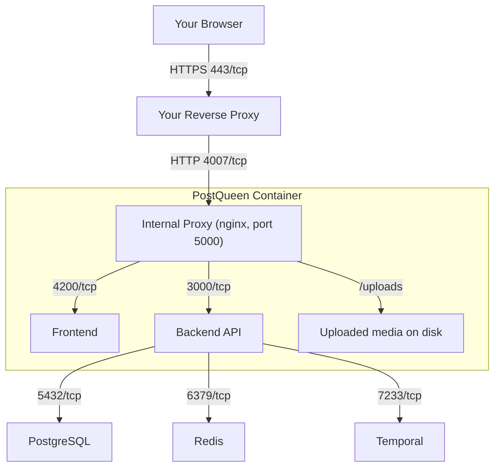

PostQueen is yours to run. Put her on your laptop to try her out, or on a small server so
your whole team can reach her. Either way the posts, the connected channels and the media
stay on hardware you control.

This page shows what she is made of and helps you pick a path. If you already know you want
the normal one, go straight to [Try her locally](/installation/quickstart-local) or
[Deploy to a server](/installation/production).

## What you are installing

PostQueen ships as one container image. Inside it a small proxy sits in front of three Node
processes, so from the outside there is only ever one port to think about. Next to her she
needs three services: a PostgreSQL database, Redis, and Temporal, which is the scheduler that
actually fires your posts at the right minute.

The official Docker Compose file starts all of that for you, which is why it is the path we
recommend to almost everyone. You do not have to install PostgreSQL, Redis or Temporal by hand.

## Which path is for you

<CardGroup cols={2}>
  <Card title="I just want to see it" icon="play" href="/installation/quickstart-local">
    Docker Compose on your own machine. Around five minutes, nothing permanent, delete it
    afterwards with one command.
  </Card>
  <Card title="I want to run it for real" icon="server" href="/installation/production">
    Docker Compose on a small server, on your own domain, with HTTPS. Start here if other
    people will use it.
  </Card>
  <Card title="I want to change the code" icon="code" href="/installation/development">
    Run her from source with hot reload, so you can edit the frontend or add a provider.
  </Card>
  <Card title="I already run Kubernetes" icon="dharmachakra" href="/installation/kubernetes-helm">
    A Helm chart, for people who already have a cluster and know they want one.
  </Card>
</CardGroup>

## What those other options in the sidebar mean

The sidebar lists a few more install methods. You almost certainly do not need them, but here
is what each one is, so you can stop wondering.

| Option | What it is | Pick it when |
| --- | --- | --- |
| [Docker Compose](/installation/docker-compose) | One file that starts PostQueen and all three services she depends on. | Almost always. This is the supported path. |
| [Docker](/installation/docker) | The PostQueen container on its own, with no database or scheduler. You bring your own. | You already run PostgreSQL, Redis and Temporal somewhere, and only want the app. |
| [Helm](/installation/kubernetes-helm) | A package for Kubernetes. Helm is to a cluster roughly what Compose is to a single machine: one command installs the whole app. | You already operate a Kubernetes cluster. If that sentence did not sound familiar, this is not your path. |
| [Development Environment](/installation/development) | The source code running on your machine with hot reload. | You are writing code for PostQueen. |
| [Dev Container](/installation/devcontainer) | The development environment above, prebuilt inside a container, so your editor sets it up for you. | You want to contribute without installing Node and pnpm yourself. |

## What she needs to run

A small virtual machine is enough. Two vCPUs and 2 GB of RAM will run a single-person install,
and 4 GB is more comfortable once a few people share it. The full numbers, including disk and
the outbound addresses she needs to reach, are on
[System Requirements](/installation/system-requirements).

You will also need Docker. Both install guides walk you through getting it.

<Note>
**One thing worth knowing before you start.** PostQueen marks her login cookies as secure,
which means a real install needs HTTPS. Locally that is handled for you. On a server you
put a reverse proxy in front of her, and
[Domain and HTTPS](/installation/domain-and-https) explains what that means and does it
with you step by step.
</Note>

## Next Steps

<Snippet file="next-steps-selfhost.mdx" />
