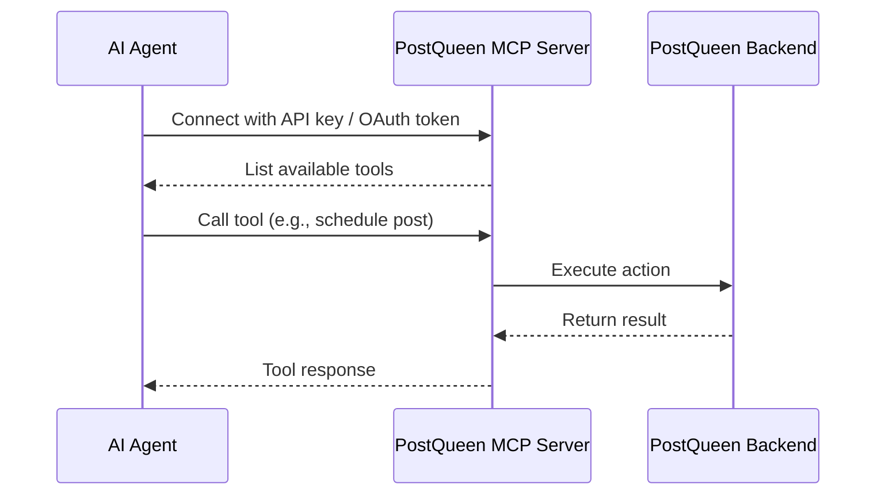

MCP (Model Context Protocol) lets AI agents work with PostQueen directly: they can list your integrations, schedule posts, and generate images and videos through a standardized tool-calling interface.

That means you can connect Claude, Cursor, or any MCP-compatible client to your PostQueen account and ask her to handle your social media in plain language. When you are ready to plug one in, head to [Client Setup](/mcp/setup) and pick your client from the guides grouped under it.


## How It Works

PostQueen exposes an MCP server that provides **10 tools** to AI agents. The agent discovers these tools, understands their schemas, and calls them on your behalf.



## Available Tools

| Tool | Description |
|------|-------------|
| `integrationList` | List all connected social media accounts (optionally filtered by group) |
| `groupList` | List all groups (customers) for your organization |
| `integrationSchema` | Get platform-specific posting rules and settings schema |
| `triggerTool` | Execute platform-specific helpers (e.g., list Discord channels) |
| `integrationSchedulePostTool` | Schedule, draft, or immediately publish posts |
| `generateImageTool` | Generate AI images for posts |
| `generateVideoOptions` | List available video generation options |
| `videoFunctionTool` | Get video generator settings (e.g., available voices) |
| `generateVideoTool` | Generate videos for posts |
| `uploadFromUrlTool` | Upload a remote image or video into your media library from a public URL |

## Authentication

There are two ways to authenticate with the MCP server:

### API Key

Get your API key from **Settings > Developers > Public API** in PostQueen. Use it directly in the MCP endpoint URL or as a Bearer token.

### OAuth Token

If you're building an app for other PostQueen users, use [OAuth2](/public-api/oauth) to obtain tokens. OAuth tokens start with `pos_` and work like API keys when sent as a Bearer token on `/mcp`. The `/mcp/:apiKey` URL form accepts API keys only.

## Connecting

The server accepts two endpoint forms, shown below. For copy-paste configuration in your specific client, the [Client Setup](/mcp/setup) hub and its per-client guides cover each one step by step.

<Tabs>
  <Tab title="Bearer Token">
    Use the `/mcp` endpoint with your API key or OAuth token as a Bearer token:

    ```
    URL: https://api.postqueen.ai/mcp
    Authorization: Bearer your-api-key
    ```

    This method supports both API keys and OAuth tokens (prefixed with `pos_`).
  </Tab>
  <Tab title="API Key in URL">
    Use the `/mcp/:apiKey` endpoint with your API key embedded in the URL:

    ```
    URL: https://api.postqueen.ai/mcp/your-api-key
    ```
  </Tab>
</Tabs>

<Note>
For self-hosted instances, replace `https://api.postqueen.ai` with your `NEXT_PUBLIC_BACKEND_URL`.
</Note>

## Quick Example

Here's what a typical interaction looks like when an AI agent uses PostQueen MCP:

1. **Agent calls `integrationList`** to see your connected accounts (X, LinkedIn, and so on)
2. **Agent calls `integrationSchema`** with `platform: "x"` to learn X's character limits, settings, and rules
3. **Agent calls `integrationSchedulePostTool`** to schedule your post in the correct format

All of this happens automatically when you tell your AI agent something like:

> "Schedule a post to X for tomorrow at 10am: Excited to announce our new feature!"

## FAQ

### Do I need an OpenAI key to use PostQueen MCP?

No key is needed for reasoning: your MCP client (Claude, Cursor, and others) provides the model. But `generateImageTool` and the video tools run PostQueen's own generation pipeline on the server, so a self-hosted backend needs `OPENAI_API_KEY` (and any video provider keys) for those specific tools. The other tools work without it.

### What happens when my API key expires or is rotated?

PostQueen API keys don't auto-rotate, but if you regenerate one in Settings > Developers > Public API, every MCP client using the old key stops working until you update its config. Update the URL or the `Authorization` header in your client config and reconnect.

### Self-hosted: how do I expose the MCP endpoint?

The MCP server starts as part of the PostQueen backend and is reachable at `/mcp` (Bearer auth) and `/mcp/:apiKey` (key in URL). Your reverse proxy must forward these paths to the backend and support streaming HTTP (`Transfer-Encoding: chunked`). See [Reverse Proxies](/reverse-proxies/caddy).

### Can MCP read or reply to comments?

Not today. The current tool set is read-only on integrations and write-only on posts and media: there is no `getComments` or `replyToComment` exposed via MCP. PostQueen does not read incoming comments. The closest feature is Auto Actions, which can repost your own post or add a follow-up comment on it once it crosses the like milestone you set.
