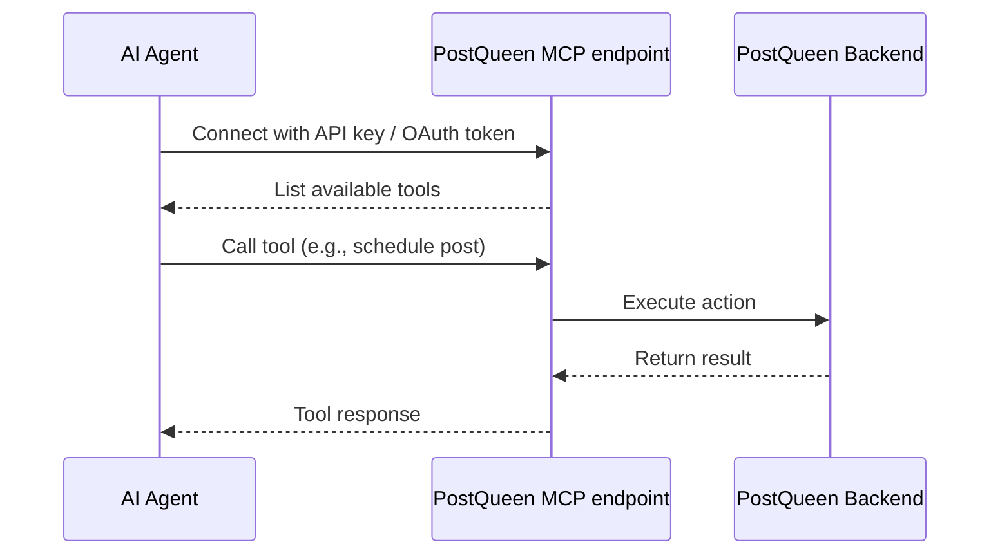

MCP (Model Context Protocol) lets AI agents work with PostQueen directly: they can list your integrations, schedule posts, and generate images and videos through a standardized tool-calling interface. Connect Claude, Cursor or any MCP-compatible client to your PostQueen account and ask her to run your social media in plain language.

<Note>
**You do not have to run or install anything.** In the protocol's own words PostQueen is the
"server" and your AI client is the "client", but she is already running at a URL. Setup is
pasting that URL into your client, and for most of them it is a single command.
</Note>

<Frame>
  
</Frame>

## How it works

Point a client at one URL and your agent gets **11 tools** it can call. It reads their schemas, then calls them on your behalf.


```mermaid
sequenceDiagram
    participant Agent as AI Agent
    participant MCP as PostQueen MCP endpoint
    participant PostQueen as PostQueen Backend

    Agent->>MCP: Connect with API key / OAuth token
    MCP-->>Agent: List available tools
    Agent->>MCP: Call tool (e.g., schedule post)
    MCP->>PostQueen: Execute action
    PostQueen-->>MCP: Return result
    MCP-->>Agent: Tool response
```

## Available tools

| Tool | Description |
|------|-------------|
| `integrationList` | List all connected social media accounts (optionally filtered by group) |
| `groupList` | List all groups (customers) for your organization |
| `integrationSchema` | Get platform-specific posting rules and settings schema |
| `triggerTool` | Execute platform-specific helpers (e.g., list Discord channels) |
| `integrationSchedulePostTool` | Schedule, draft, or immediately publish posts |
| `generateImageTool` | Generate AI images for posts |
| `generateVideoOptions` | List available video generation options |
| `videoFunctionTool` | Get video generator settings (e.g., available voices) |
| `generateVideoTool` | Generate videos for posts |
| `uploadFromUrlTool` | Upload a remote image or video into your media library from a public URL |
| `ask_postqueen` | Hand her the whole request in plain language and let her pick the steps |

<Note>
Ten of those are the same tools the in-app assistant runs. The eleventh, `ask_postqueen`, exists
only over MCP: your client is talking to her as an agent, so it can either drive the individual
tools itself or hand the whole job to her. That is why pages about the assistant say ten and
pages about MCP say eleven.
</Note>

Every parameter and every field each tool sends back: [Tools Reference](/mcp/tools).

## Authentication

There are two ways to authenticate.

<CardGroup cols={2}>
  <Card title="API key" icon="key">
    Get your API key from **Settings > Developers > Public API** in PostQueen. Use it directly in
    the MCP endpoint URL or as a Bearer token.
  </Card>
  <Card title="OAuth token" icon="shield-halved">
    Building an app for other PostQueen users? Use [OAuth2](/public-api/oauth) to obtain tokens.
    OAuth tokens start with `pos_` and work like API keys when sent as a Bearer token on `/mcp`.
    The `/mcp/:apiKey` URL form accepts API keys only.
  </Card>
</CardGroup>

## Connecting

The server accepts two endpoint forms. Copy-paste configuration for your client: [Connect your client](/mcp/setup).

<Tabs>
  <Tab title="Bearer Token">
    Use the `/mcp` endpoint with your API key or OAuth token as a Bearer token:

    ```
    URL: https://api.postqueen.ai/mcp
    Authorization: Bearer your-api-key
    ```

    This method supports both API keys and OAuth tokens (prefixed with `pos_`).
  </Tab>
  <Tab title="API Key in URL">
    Use the `/mcp/:apiKey` endpoint with your API key embedded in the URL:

    ```
    URL: https://api.postqueen.ai/mcp/your-api-key
    ```
  </Tab>
</Tabs>

<Note>
For self-hosted instances, replace `https://api.postqueen.ai` with your `NEXT_PUBLIC_BACKEND_URL`.
</Note>

## Quick example

Tell your AI agent something like:

> "Schedule a post to X for tomorrow at 10am: Excited to announce our new feature!"

Three tool calls go by before you look up.

<Steps>
  <Step title="Read your channels">
    The agent calls `integrationList` to see your connected accounts (X, LinkedIn, and so on).
  </Step>
  <Step title="Read the platform rules">
    The agent calls `integrationSchema` with `platform: "x"` to learn X's character limits,
    settings, and rules.
  </Step>
  <Step title="Schedule the post">
    The agent calls `integrationSchedulePostTool` to schedule your post in the correct format.
  </Step>
</Steps>

<Check>
**That is the whole loop.** All of this happens automatically: you wrote one sentence, and the
post is on your calendar in the format X expects.
</Check>

## FAQ

<AccordionGroup>
  <Accordion title="Do I need an OpenAI key to use PostQueen MCP?">
    No key is needed for reasoning: your MCP client (Claude, Cursor and others) brings the model.
    But `generateImageTool` and the video tools run her own generation pipeline on the server, so
    a self-hosted backend needs `OPENAI_API_KEY` (and any video provider keys) for those specific
    tools. The other tools work without it.
  </Accordion>

  <Accordion title="What happens when my API key expires or is rotated?">
    PostQueen API keys do not auto-rotate, but if you regenerate one in Settings > Developers >
    Public API, every MCP client using the old key stops working until you update its config.
    Update the URL or the `Authorization` header in your client config and reconnect.
  </Accordion>

  <Accordion title="Self-hosted: how do I reach the MCP endpoint?">
    Your backend already serves it. The endpoint sits at `/mcp` (Bearer auth) and `/mcp/:apiKey`
    (key in URL). Your reverse proxy has to forward these paths and stream the response rather
    than buffering it: [MCP on a self-hosted install](/mcp/self-hosting).
  </Accordion>

  <Accordion title="Can MCP read or reply to comments?">
    Not today. The current tool set is read-only on integrations and write-only on posts and
    media: there is no `getComments` or `replyToComment` tool. She does not read incoming
    comments. The closest feature is [Auto Actions](/using/auto-actions), which can repost your
    own post or add a follow-up comment on it once it crosses the like milestone you set.
  </Accordion>
</AccordionGroup>

## Next steps

<CardGroup cols={2}>
  <Card title="Connect your client" icon="plug" href="/mcp/setup">
    The URL for Claude, Cursor, Codex, ChatGPT and the rest
  </Card>
  <Card title="Tools Reference" icon="screwdriver-wrench" href="/mcp/tools">
    Every parameter and every field the eleven tools send back
  </Card>
  <Card title="Examples" icon="lightbulb" href="/mcp/examples">
    The flows where an agent has to discover something before it can post
  </Card>
  <Card title="Limits and troubleshooting" icon="gauge-high" href="/mcp/limits-and-troubleshooting">
    What the tools cannot reach, and what a bad key looks like
  </Card>
</CardGroup>
