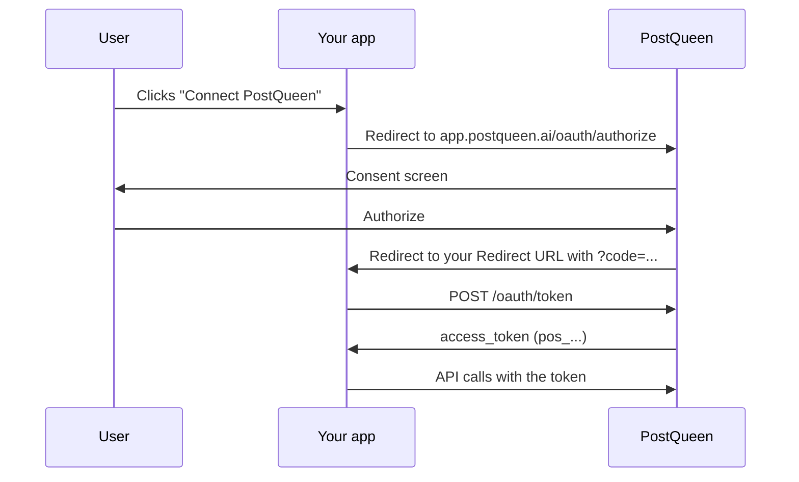

If you are automating your own workspace, use its [API key](/public-api/introduction#authentication). If you are building a product that other PostQueen users connect to, use OAuth: they approve your app on a PostQueen consent screen, and you get a `pos_` token that acts on their workspace. Nobody hands you their API key.

A `pos_` token works on every [public API](/public-api/introduction) endpoint, sent the same way as a key: `Authorization: pos_...`, with no prefix. It also works on the MCP server at `https://api.postqueen.ai/mcp`, sent there as `Authorization: Bearer pos_...`. It does not work in the `/mcp/YOUR_API_KEY` address, which only takes API keys.

## How it works



## Set it up

<Steps>
  <Step title="Create the app">
    In PostQueen, open **Connections > Developers** and choose **Create OAuth App**. Fill in:

    | Field | What it is for |
    |---|---|
    | **App Name** | Shown to people on the consent screen |
    | **Description** | Optional. Shown on the consent screen |
    | **Profile Picture** | Optional. Shown on the consent screen |
    | **Redirect URL** | Where PostQueen sends people after they choose **Authorize** or **Deny** |

    You get a **Client ID** (`pca_...`) and a **Client Secret** (`pcs_...`). A workspace has one OAuth app, and only a workspace Admin or Super Admin can create, edit or delete it.

    <Warning>
    The Client Secret is shown once. Copy it and keep it on your server. If you lose it, choose **Rotate Secret**.
    </Warning>
  </Step>

  <Step title="Send people to the consent screen">
    ```text
    https://app.postqueen.ai/oauth/authorize?client_id=pca_YOUR_CLIENT_ID&response_type=code&state=RANDOM_STATE
    ```

    | Parameter | What it is |
    |---|---|
    | `client_id` | Your Client ID. Required |
    | `response_type` | Always `code`. Required |
    | `state` | A random value you check on the way back, against forged callbacks. Recommended |

    The person signs in if they need to, sees your app's name, description and picture, and chooses **Authorize** or **Deny**.

    <Note>
    Only a workspace Admin or Super Admin can authorize an app. The token acts with full rights on the workspace, like its API key, so a regular member cannot hand one out.
    </Note>
  </Step>

  <Step title="Take the code from the callback">
    PostQueen redirects to your **Redirect URL**:

    ```text
    https://yourapp.example.com/callback?code=AUTHORIZATION_CODE&state=RANDOM_STATE
    ```

    Check that `state` is the value you sent. If the person chose **Deny**, the callback carries `error=access_denied` instead of a code. The code works once, for 10 minutes.
  </Step>

  <Step title="Exchange the code for a token">
    From your server:

    ```bash
    curl -X POST "https://api.postqueen.ai/oauth/token" \
      -H "Content-Type: application/json" \
      -d '{
        "grant_type": "authorization_code",
        "code": "AUTHORIZATION_CODE",
        "client_id": "pca_YOUR_CLIENT_ID",
        "client_secret": "pcs_YOUR_CLIENT_SECRET"
      }'
    ```

    You can also send the Client ID and Secret as HTTP Basic credentials in `Authorization` and leave them out of the body. The answer is `201`:

    ```json
    {
      "id": "cmg1oxk4b0000qz0h1f3e9a2c",
      "cus": "cus_QkT3uV8wXyZ12a",
      "access_token": "pos_8Jd02kLq9ZmX4tR7vB1nC6yH3wE5pA0sF2gD4hK8",
      "token_type": "bearer",
      "scope": "mcp:read mcp:write"
    }
    ```

    `id` is the workspace the person approved your app for. Store `access_token`; the code is spent. Every field: [Get an access token](/public-api/oauth/token).
  </Step>

  <Step title="Call the API">
    ```bash
    curl -H "Authorization: pos_YOUR_ACCESS_TOKEN" \
      "{{apiBase}}/integrations"
    ```

    <Check>
    A list of the person's channels means the token works. From here every endpoint in this reference is open to your app.
    </Check>
  </Step>
</Steps>

## How long a token lasts

The token has no expiry date. It stops working when:

- the person revokes your app under **Connections > Approved Apps**;
- the person who approved it is removed from the workspace, disabled, or deletes their account;
- the same person approves your app again in the same workspace: the new token replaces the old one;
- you delete your app.

**Rotate Secret** replaces the Client Secret at once, so token requests with the old secret fail, but tokens already issued keep working. **Delete App** revokes every token your app holds; it cannot be undone.

## Clients that register themselves

MCP clients and other tools can register without anyone creating an app: `POST https://api.postqueen.ai/oauth/register` (Dynamic Client Registration, RFC 7591) takes no API key.

```bash
curl -X POST "https://api.postqueen.ai/oauth/register" \
  -H "Content-Type: application/json" \
  -d '{
    "client_name": "My MCP client",
    "redirect_uris": ["http://127.0.0.1:33418/callback"],
    "token_endpoint_auth_method": "none"
  }'
```

A registered client gets a `pcd_` Client ID and differs from an app made under **Developers**:

| | App under Developers | Registered client |
|---|---|---|
| Callback | Its stored **Redirect URL** | One of its `redirect_uris`, sent on both the consent URL and the token request |
| Secret | Always | None when registered with `token_endpoint_auth_method: none` |
| PKCE | Optional | Required for a client without a secret, with `S256` |
| Callbacks allowed | The one URL you set | `https`, `http` on `localhost`, `127.0.0.1` or `[::1]`, or a private scheme such as `cursor://` |

A registered client that nobody has approved after 30 days may be removed. The answer carries `client_id`, `client_secret` (only for a client with a secret, shown once), `redirect_uris`, `token_endpoint_auth_method`, `grant_types: ["authorization_code"]` and `scope`. A callback that breaks the rules answers `400 invalid_redirect_uri`.

## Full example (Node.js)

<Accordion title="Express: redirect, callback, token exchange and a first call" icon="code">

```javascript
import express from "express";
import session from "express-session";
import crypto from "node:crypto";

const CLIENT_ID = process.env.PQ_CLIENT_ID;         // pca_...
const CLIENT_SECRET = process.env.PQ_CLIENT_SECRET; // pcs_...
// The callback below must live at the Redirect URL you set on the app.

const app = express();
app.use(session({ secret: "change-me", resave: false, saveUninitialized: false }));

app.get("/connect", (req, res) => {
  const state = crypto.randomBytes(16).toString("hex");
  req.session.oauthState = state;
  const params = new URLSearchParams({ client_id: CLIENT_ID, response_type: "code", state });
  res.redirect(`https://app.postqueen.ai/oauth/authorize?${params}`);
});

app.get("/callback", async (req, res) => {
  const { code, state, error } = req.query;
  if (error === "access_denied") return res.send("Access was denied.");
  if (!state || state !== req.session.oauthState) return res.status(403).send("Invalid state");

  const tokenRes = await fetch("https://api.postqueen.ai/oauth/token", {
    method: "POST",
    headers: { "Content-Type": "application/json" },
    body: JSON.stringify({
      grant_type: "authorization_code",
      code,
      client_id: CLIENT_ID,
      client_secret: CLIENT_SECRET,
    }),
  });
  if (tokenRes.status !== 201) return res.status(502).json(await tokenRes.json());
  const { access_token } = await tokenRes.json();

  // Store access_token for this user. Then, for example, list their channels:
  const channels = await fetch("{{apiBase}}/integrations", {
    headers: { Authorization: access_token },
  }).then((r) => r.json());

  res.json({ connected: true, channels });
});

app.listen(3000);
```

</Accordion>

## Errors

| Error | Where | What it means |
|---|---|---|
| `Invalid client_id` | Consent screen | The Client ID does not exist, or its app was deleted |
| `access_denied` | Your callback | The person chose **Deny** |
| `invalid_client` (`401`) | Token request | Unknown Client ID, or a wrong or missing secret |
| `invalid_grant` (`400`) | Token request | The code is wrong, used or older than 10 minutes, or `code_verifier` or `redirect_uri` does not match |
| `unsupported_grant_type` (`400`) | Token request | `grant_type` is not `authorization_code` |

## Next steps

<CardGroup cols={2}>
  <Card title="Check an authorization request" icon="user-check" href="/public-api/oauth/authorize">
    The call behind the consent screen, useful to test a Client ID.
  </Card>
  <Card title="Get an access token" icon="key" href="/public-api/oauth/token">
    The token request, field by field.
  </Card>
  <Card title="List channels" icon="list" href="/public-api/integrations/list">
    The first call most apps make with a new token.
  </Card>
  <Card title="Limits and errors" icon="gauge" href="/public-api/limits-and-errors">
    The hourly limits and every status code.
  </Card>
</CardGroup>
