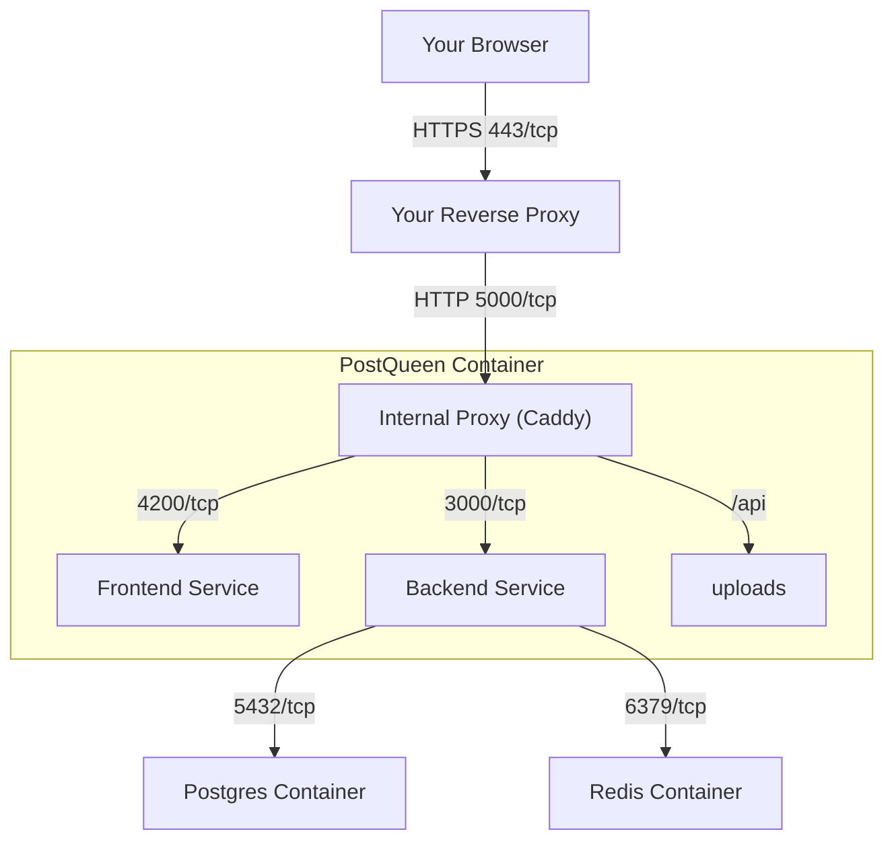

## Installation Prerequisites

A few services have to be in place before she can start.

### Network Requirements

#### HTTPS / HTTP Requirement

She marks her login cookies as Secure. Browsers call this a "secure context".

If you want a secure login process, you need a certificate, which a reverse proxy like Caddy or Nginx can give you.

If you cannot use a certificate (HTTPS), add the following environment variable to your `.env` file:
```env
NOT_SECURED=true
```
<Warning>
**Security Warning**: Setting `NOT_SECURED=true` disables secure cookie requirements. This should only be used in development environments or when you fully understand the security implications. Not recommended for production use.
</Warning>

#### Network Ports

- **5000/tcp**: the **single entry point** for PostQueen when running in a container. This is the one port your reverse proxy should talk to.
- **4200/tcp**: for the **Frontend** service (the web interface). You do not need to expose this port publicly.
- **3000/tcp**: for the **Backend** service (the API). You do not need to expose this port publicly.
- **5432/tcp**: for the **Postgres** container. You do not need to expose this port publicly.
- **6379/tcp**: for the **Redis** container. You do not need to expose this port publicly.

Using docker images? Point your external proxy at port 5000 and nothing else. One port is harder to misconfigure and easier to reason about later.



