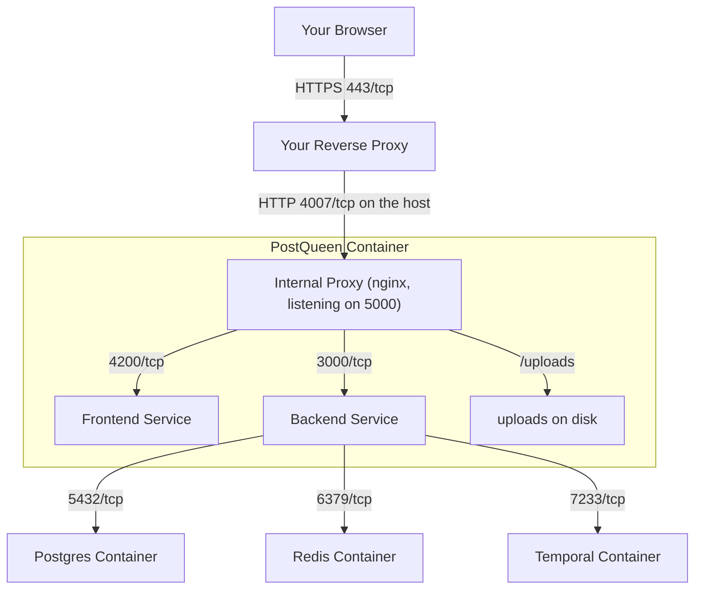

## Installation Prerequisites

A few things have to be in place before she can start.

### HTTPS is effectively required

She marks her login cookies as Secure, which browsers only send over an encrypted connection.
On a real install you put a reverse proxy in front of her to hold the certificate, and
[Domain and HTTPS](/installation/domain-and-https) walks through that.

If you genuinely cannot use a certificate, for example while developing on your own machine,
there is an escape hatch:

```env
NOT_SECURED=true
```

<Warning>
**Security Warning**: `NOT_SECURED=true` drops the secure-cookie requirements, which means
session cookies travel in the clear. Use it for local development only, never on a server other
people can reach.
</Warning>

### Network ports

Inside the container everything arrives on one port, and a small proxy splits it up from there.
That is deliberate: one port is harder to misconfigure than three.

| Port | What it is | Exposed? |
| --- | --- | --- |
| **5000** | The single entry point **inside** the container | Only within Docker |
| **4007** | Where Docker Compose publishes port 5000 **on your host** | Yes, this is the one your reverse proxy talks to |
| 4200 | Frontend, inside the container | No |
| 3000 | Backend API, inside the container | No |
| 5432 | PostgreSQL | No |
| 6379 | Redis | No |
| 7233 | Temporal, bound to `127.0.0.1` | Server only |
| 8080 | Temporal dashboard, bound to `127.0.0.1` | Server only |

<Note>
**5000 or 4007?** Both, depending on where you are standing. She always listens on 5000 inside
the container. The Compose file publishes that as 4007 on the host, so a reverse proxy running
on the host uses **4007**. If you run PostQueen with
[Docker on its own](/installation/docker) and map `-p 5000:5000`, the host port is 5000
instead. A proxy that reaches her over the Docker network, such as Traefik, uses 5000 either
way.
</Note>


